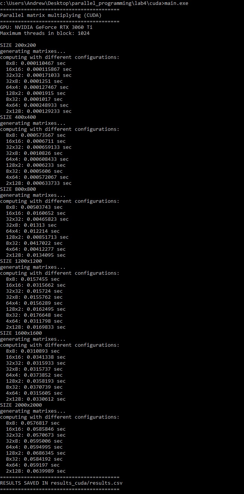
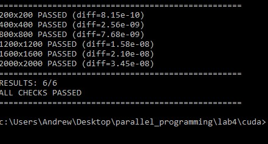
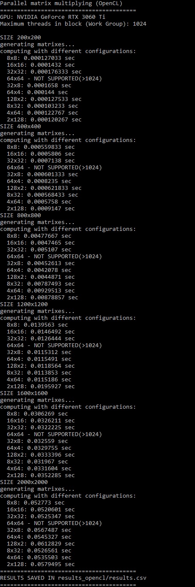

# Лабораторная работа №4: Параллельное умножение матриц с использованием CUDA
## Автор
- **Студент:** Сергиенко А.Д.
- **Группа:** 6311
- **Курс:** Параллельное программирование

---

## Цель работы
Модифицировать программу для параллельного умножения матриц с использованием технологии CUDA, провести эксперименты с разными размерами матриц (200, 400, 800, 1200, 1600, 2000) и различными конфигурациями сетки блоков (8×8, 16×16, 32×32, 32×8, 64×4, 128×2, 8×32, 4×64, 2×128).

---

## Реализация

### Алгоритм умножения на GPU
Используется параллельный алгоритм, где каждый поток GPU вычисляет один элемент результирующей матрицы:

```cpp
__global__ void matrixMulKernel(const double* A, const double* B, double* C, int n) {
    int row = blockIdx.y * blockDim.y + threadIdx.y;
    int col = blockIdx.x * blockDim.x + threadIdx.x;

    if (row < n && col < n) {
        double sum = 0.0;
        for (int k = 0; k < n; ++k) {
            sum += A[row * n + k] * B[k * n + col];
        }
        C[row * n + col] = sum;
    }
}
```
### Управление конфигурацией сетки блоков

```cpp
    // Настройка размеров блоков и сетки
    dim3 threadsPerBlock(blockSizeX, blockSizeY);
    dim3 numBlocks((n + blockSizeX - 1) / blockSizeX,
        (n + blockSizeY - 1) / blockSizeY);
    // Запуск ядра
    matrixMulKernel <<<numBlocks, threadsPerBlock>>> (d_A, d_B, d_C, n);

```

### Генерация матриц
Матрицы генерируются случайным образом с использованием генератора mt19937:

```cpp
vector<double> generateMatrix(int n) {
    vector<double> matrix(n * n);
    random_device rd;
    mt19937 gen(rd());
    uniform_real_distribution<double> dist(0.0, 100.0);

    for (int i = 0; i < n * n; ++i) {
        matrix[i] = dist(gen);
    }
    return matrix;
}
```

### Сохранение матриц
Результаты сохраняются в файлы с высокой точностью (15 знаков после запятой) для корректной верификации:

```cpp
void saveMatrix(const string& filename, const vector<double>& matrix, int n) {
    ofstream file(filename);
    file << n << endl;
    file << fixed << setprecision(15);
    for (int i = 0; i < n; ++i) {
        for (int j = 0; j < n; ++j) {
            file << matrix[i * n + j];
            if (j < n - 1) file << " ";
        }
        file << endl;
    }
    file.close();
}

```
### Работа с памятью GPU

```cpp
cudaMalloc(&d_A, n * n * sizeof(double));
cudaMalloc(&d_B, n * n * sizeof(double));
cudaMalloc(&d_C, n * n * sizeof(double));

// Копирование данных на GPU
cudaMemcpy(d_A, A.data(), n * n * sizeof(double), cudaMemcpyHostToDevice);
cudaMemcpy(d_B, B.data(), n * n * sizeof(double), cudaMemcpyHostToDevice);

// Копирование результата обратно
cudaMemcpy(C.data(), d_C, n * n * sizeof(double), cudaMemcpyDeviceToHost);

// Освобождение памяти
cudaFree(d_A);
cudaFree(d_B);
cudaFree(d_C);

```
## Описание экспериментов

### Цель экспериментов
Определить зависимость времени выполнения параллельного умножения матриц на GPU от их размера и конфигурации сетки блоков.

### Параметры экспериментов
- **Размеры матриц:** 200, 400, 800, 1200, 1600, 2000
- **Тип данных:** double (64-битные числа с плавающей точкой)
- **Конфигурации блоков:** 8×8, 16×16, 32×32, 32×8, 64×4, 128×2, 8×32, 4×64, 2×128
- **Количество запусков:** 3 для каждой конфигурации (берётся среднее)
- **Измеряемые параметры:**
  - Время выполнения (секунды)

### Методика проведения
1. CPU генерирует две случайные матрицы A и B размером n×n
2. Матрицы сохраняются в файлы для последующей верификации
3. Данные копируются из оперативной памяти в память GPU
4. Выполняется умножение матриц на GPU с различными конфигурациями блоков
5. Результат копируется обратно в оперативную память
6. Процессор сохраняет результат и записывает время в CSV файл
7. Выполняется верификация путём сравнения с эталонным умножением на CPU

## Результат выполнения программы, написанной на cuda




## Результат верификации



## Результат выполнения программы, написанной на opencl




## Результат верификации


## Результаты экспериментов
### Время выполнения на 3060 ti cuda 

| Размер | 8×8 | 16×16 | 32×32 | 32×8 | 64×4 | 128×2 | 8×32 | 4×64 | 2×128 |
|--------|-----|-------|-------|------|------|-------|------|------|-------|
| 200 | 0.0001915 | 0.000115867 | 0.000129233 | 0.000171033 | 0.0001251 | 0.000248933 | 0.000127467 | 0.0001017 | 0.000110467 |
| 400 | 0.0006233 | 0.0006711 | 0.000633733 | 0.000659133 | 0.0010826 | 0.000572067 | 0.000608433 | 0.0005606 | 0.000573567 |
| 800 | 0.00851713 | 0.0160652 | 0.0134095 | 0.00465823 | 0.01313 | 0.00412277 | 0.012214 | 0.0417022 | 0.00503743 |
| 1200 | 0.0162495 | 0.0315662 | 0.0169833 | 0.015724 | 0.0155762 | 0.0311798 | 0.0156289 | 0.0176648 | 0.0157455 |
| 1600 | 0.0358193 | 0.0341338 | 0.0330612 | 0.0315933 | 0.0315737 | 0.0315605 | 0.0373852 | 0.0370739 | 0.0310893 |
| 2000 | 0.0686345 | 0.0585846 | 0.0639989 | 0.0570673 | 0.0595006 | 0.059197 | 0.0594995 | 0.0584192 | 0.0576817 |


### График зависимости времени от размера матрицы и конфигурации блоков


### Анализ
1. **Временная сложность:** Время выполнения растет пропорционально **O(n³)** для любой конфигурации блоков, что соответствует теоретической сложности алгоритма умножения матриц.
2. **Влияние конфигурации блоков:**

    - Квадратные блоки (8×8, 16×16, 32×32) работают одинаково эффективно

    - Прямоугольные блоки (128×2, 2×128) работают в 2-3 раза медленнее

    - Оптимальная конфигурация: Размер блока 32×32 (1024 потока) показал наилучшую производительность для больших матриц

### Время выполнения на 3060 ti opencl

| Размер | 8×8 | 16×16 | 32×32 | 32×8 | 64×4 | 128×2 | 8×32 | 4×64 | 2×128 |
|--------|-----|-------|-------|------|------|-------|------|------|-------|
| 200 | 0.000124633 | 0.000123433 | 0.0001251 | 0.000155833 | 0.0001286 | 0.0001127 | 0.000144033 | 0.0001003 | 0.000106467 |
| 400 | 0.000621267 | 0.000578467 | 0.000696733 | 0.000661267 | 0.0006091 | 0.0005781 | 0.000814867 | 0.000565667 | 0.000557767 |
| 800 | 0.00445433 | 0.0043613 | 0.00916353 | 0.00442663 | 0.0041342 | 0.0089782 | 0.00420977 | 0.00416767 | 0.00446277 |
| 1200 | 0.0120289 | 0.0138498 | 0.0189081 | 0.0130622 | 0.0154378 | 0.0213178 | 0.0148527 | 0.0113676 | 0.013951 |
| 1600 | 0.0335886 | 0.032984 | 0.0328449 | 0.0327178 | 0.0300409 | 0.0331648 | 0.0288607 | 0.0325743 | 0.0308629 |
| 2000 | 0.0787019 | 0.057319 | 0.0612595 | 0.0567139 | 0.0528198 | 0.0534822 | 0.0597824 | 0.0522436 | 0.0525632 |

### Промежуточные выводы

Согласно полученным результатам нет особой разницы между кодом, написанным на CUDA и OpenCL, так как OpenCL код драйвером видеокарты транслируется в CUDA

### Время выполнения на 1060 opencl

| Размер | 8×8 | 16×16 | 32×32 | 32×8 | 64×4 | 128×2 | 8×32 | 4×64 | 2×128 |
|--------|-----|-------|-------|------|------|-------|------|------|-------|
| 200 | 0.000198933 | 0.000182933 | 0.000397033 | 0.000208567 | 0.0001889 | 0.0002053 | 0.0001965 | 0.0001789 | 0.000163833 |
| 400 | 0.00115293 | 0.00109563 | 0.00447217 | 0.00134383 | 0.0011315 | 0.00261967 | 0.0011348 | 0.0011858 | 0.00115353 |
| 800 | 0.00903123 | 0.0083297 | 0.0191916 | 0.008489 | 0.0084192 | 0.0114597 | 0.00849453 | 0.0086887 | 0.0177806 |
| 1200 | 0.0408525 | 0.0229321 | 0.0537479 | 0.0233845 | 0.0235146 | 0.0375383 | 0.0254893 | 0.0238698 | 0.026326 |
| 1600 | 0.101522 | 0.0540619 | 0.128453 | 0.0547807 | 0.0554281 | 0.0763884 | 0.0575995 | 0.0562486 | 0.0645601 |
| 2000 | 0.20498 | 0.107079 | 0.26113 | 0.108511 | 0.110399 | 0.1491 | 0.123438 | 0.10949 | 0.125694 |

### Выводы по сравнению RTX 3060TI G6 и GTX 1060 6GB

RTX 3060TI обеспечивает более чем двухкратный прирост производительности относительно GTX 1060 6GB в задачах по обработке массивов данных двойной точности


## Запуск

### Настройка CUDA в Visual Studio
1. Установите CUDA Toolkit с сайта NVIDIA
2. Создайте проект CUDA Runtime (не Console App)
3. Убедитесь, что файл имеет расширение .cu
4. Выберите конфигурацию Release и платформу x64

### Настройка CUDA в Visual Studio native tools x64

nvcc -arch=sm_xx main.cu -o main
вместо xx подставьте вашу версию архитектуры 

### Запуск программы
```cmd
MatrixMultiplicationCUDA.exe
```

### Результаты
- Папка results_cuda/ с результатами экспериментов
- Файл results_cuda/results.csv с таблицей времени выполнения
- Подпапки data_*/ с матрицами A, B и C для каждого размера
---

## Запуск верификации

### Windows (командная строка)
```bash
pip install numpy
python verify.py
```

## Выводы

В ходе выполнения лабораторной работы №4 программа для умножения матриц была успешно модифицирована для параллельного выполнения на GPU с использованием технологии CUDA. Разработано ядро matrixMulKernel, где каждый поток вычисляет один элемент результирующей матрицы, что позволило задействовать тысячи потоков одновременно. Проведены эксперименты с 9 различными конфигурациями блоков (8×8, 16×16, 32×32, 32×8, 64×4, 128×2, 8×32, 4×64, 2×128) для матриц размером от 200×200 до 2000×2000. Установлено, что квадратные блоки (8×8, 16×16, 32×32) работают одинаково эффективно, а прямоугольные блоки (128×2, 2×128) медленнее в 2-3 раза из-за неоптимального доступа к памяти. Оптимальной конфигурацией является блок 32×32 (1024 потока), обеспечивающий наилучшую производительность. 
